# Hospital Queue Management System — UI Flow & Functionality Guide

## Table of Contents
1. [System Overview](#system-overview)
2. [Roles & Access Control](#roles--access-control)
3. [Authentication](#authentication)
4. [Receptionist Portal](#receptionist-portal)
5. [Doctor Portal](#doctor-portal)
6. [Admin Portal](#admin-portal)
7. [Reports Module](#reports-module)
8. [Staff Chat](#staff-chat)
9. [Real-Time Features](#real-time-features)
10. [Queue Status Lifecycle](#queue-status-lifecycle)
11. [Test Credentials](#test-credentials)

---

## System Overview

A multi-role web application for managing patient queues in real time. Staff register patients at the front desk, patients are assigned to departments and doctors, doctors call and process patients from their personal queue, and admins oversee the entire system. All queue changes and doctor status updates are pushed live to all connected browsers via WebSocket.

---

## Roles & Access Control

| Role | Who uses it | Default landing page |
|---|---|---|
| **ADMIN** | System administrator | `/admin/dashboard` |
| **DOCTOR** | Healthcare provider | `/doctor/dashboard` |
| **RECEPTIONIST** | Front-desk staff | `/receptionist/dashboard` |

Pages enforce role restrictions both server-side (`@PreAuthorize`) and in the Thymeleaf templates (`sec:authorize`). Visiting a page you are not authorised for returns a **403 Forbidden** error page.

---

## Authentication

### Login — `GET /auth/login`

The entry point for all users.

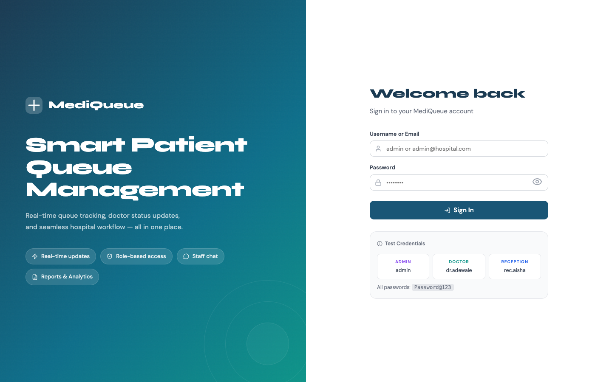

**Layout:** Split screen — a branded hero panel on the left and the login form on the right.

**Steps:**
1. Enter username and password.
2. Click **Sign In**.
3. On success, the server reads your role and redirects you to your role-specific dashboard.
4. On failure, an inline error message appears beneath the form.

**Extras:**
- A **quick-fill widget** shows sample credentials (`admin`, `dr.adewale`, `rec.aisha`) so you can click to populate the fields instantly during development.
- Password visibility can be toggled.

---

### Register — `GET /auth/register`

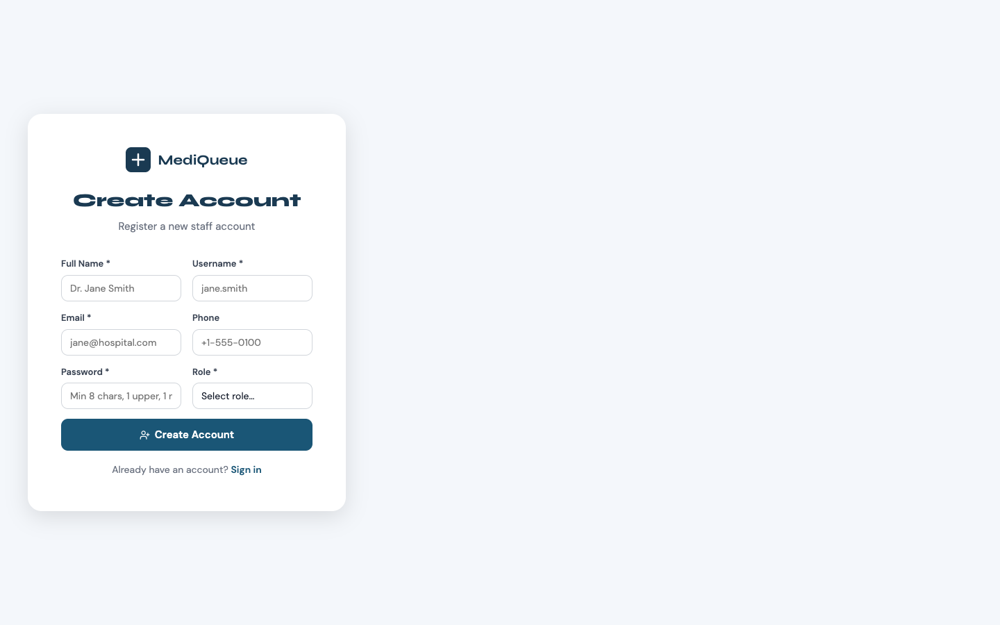

Allows new staff members to create an account.

**Steps:**
1. Fill in **Full Name**, **Username**, **Email**, **Phone**, **Password**, and **Role**.
2. If you choose the **DOCTOR** role, three additional fields appear: **Department** (dropdown of active departments), **Specialisation**, and **License Number**.
3. Submit. On success you are redirected to the login page.

---

## Receptionist Portal

### Dashboard — `GET /receptionist/dashboard`

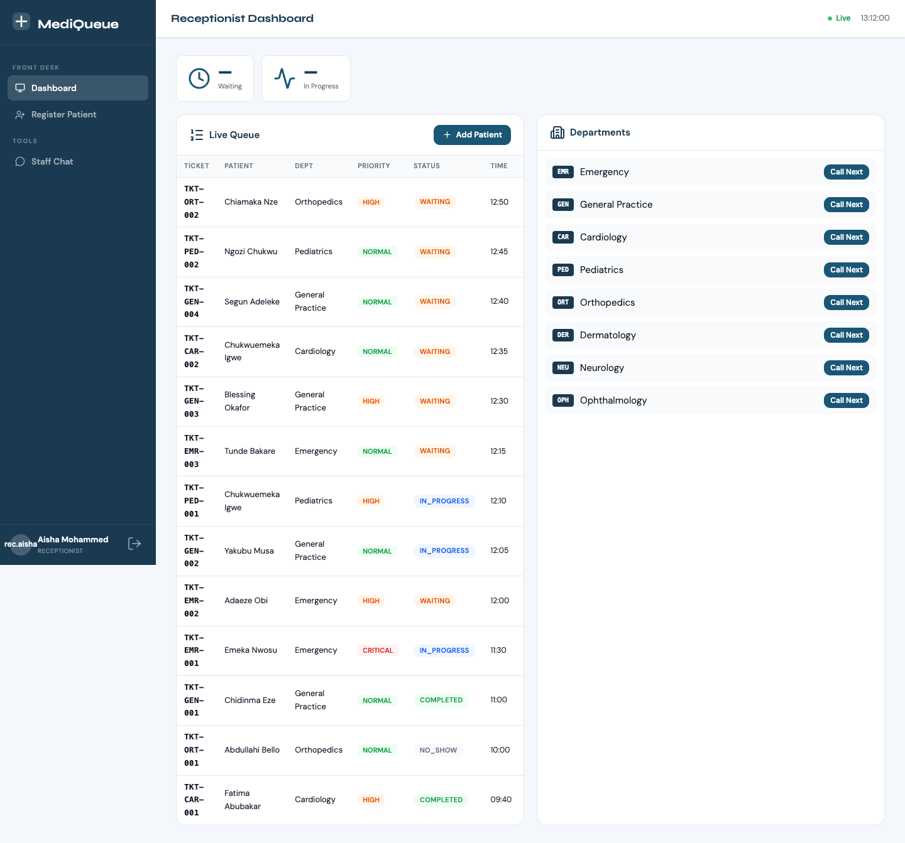

The main operational screen for front-desk staff. Everything needed to manage the live queue is on one page.

**What you see:**

| Section | Description |
|---|---|
| **Stats bar** | Live count of patients currently *Waiting* and *In Progress*, updated via WebSocket. |
| **Live Queue Table** | Every active queue entry: ticket number, patient name, department, priority badge (colour-coded), status badge, time registered, and a *Call Next* button. |
| **Department Summary Panel** | One row per department showing its queue count and a dedicated *Call Next* button. |

**Actions:**
- **Call Next** (per department): Promotes the highest-priority *WAITING* patient in that department to *CALLED* status. The table refreshes automatically.
- **Register Patient** button: Navigates to the patient registration page.

---

### Register Patient — `GET /receptionist/register-patient`

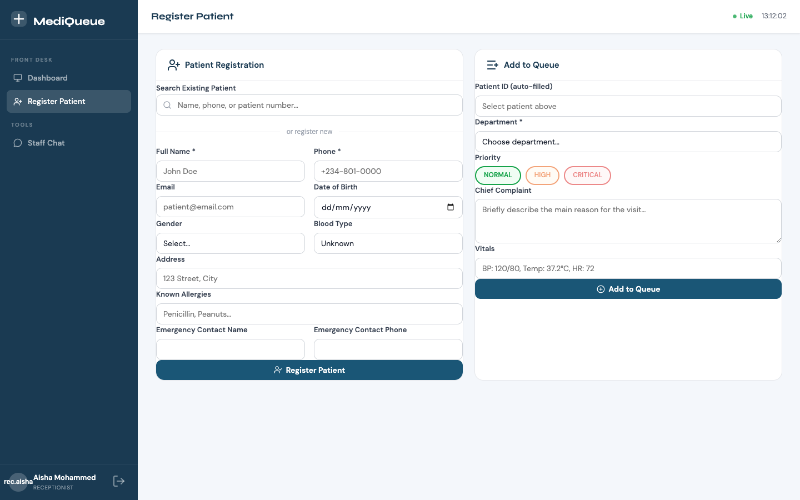

Two-panel layout handling both patient creation and queue enrolment.

**Left panel — Patient details:**
1. Use the **search bar** to look up an existing patient by name, phone number, or patient number.
2. If the patient is not found, fill in the form:
   - **Required:** Full Name, Phone
   - **Optional:** Email, Date of Birth, Gender, Blood Type, Address, Allergies, Emergency Contact
3. Click **Save Patient** → `POST /receptionist/patients`.

**Right panel — Add to Queue:**
1. The selected or newly created patient appears at the top of the panel.
2. Choose a **Department** from the dropdown.
3. Set **Priority**: NORMAL / HIGH / CRITICAL (radio buttons).
4. Enter a **Chief Complaint** and optional **Vitals** (e.g., `BP: 120/80, Temp: 37.2°C`).
5. Click **Add to Queue** → `POST /receptionist/queue` (JSON request).
6. On success a **ticket panel** appears showing:
   - The generated ticket number (e.g., `TKT-GEN-001`)
   - Estimated wait time in minutes
   - Position in the queue
   - A **Print Ticket** button for a physical copy

---

## Doctor Portal

### Dashboard — `GET /doctor/dashboard`

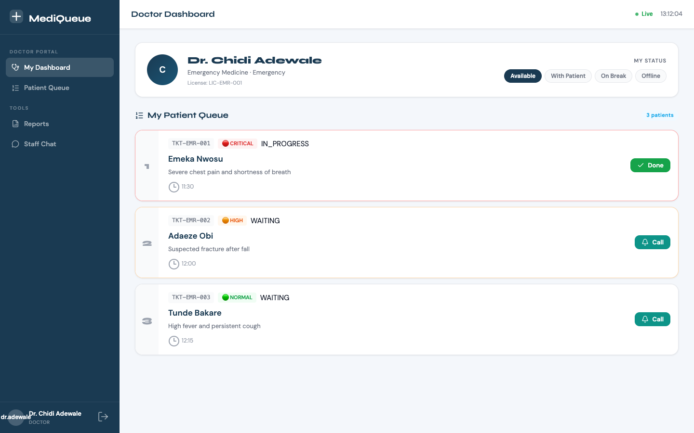

The doctor's personal command centre showing their profile and their slice of the queue.

**Profile card (top):**
- Avatar (initials), full name, specialisation, department, license number.
- **Status switcher**: Four pill buttons — AVAILABLE, BUSY, ON BREAK, OFFLINE. Clicking one sends `POST /doctor/status?status=<STATUS>` and updates your card on the Admin dashboard in real time.

**My Patient Queue:**
- Each patient appears as a card with: position number, priority colour bar, ticket number, priority badge, status badge, patient name, chief complaint, registration time, and vitals.
- **Action buttons change based on the current status:**

| Current status | Button shown | Resulting status |
|---|---|---|
| WAITING | **Call** | CALLED |
| CALLED | **Start** | IN_PROGRESS |
| CALLED | **No-Show** | NO_SHOW |
| IN_PROGRESS | **Done** | COMPLETED |

- Each button sends `POST /doctor/queue/{entryId}/status?status=<STATUS>`.
- The queue refreshes in real time via WebSocket subscription to the doctor's department topic.

---

### Patient Queue — `GET /doctor/queue`

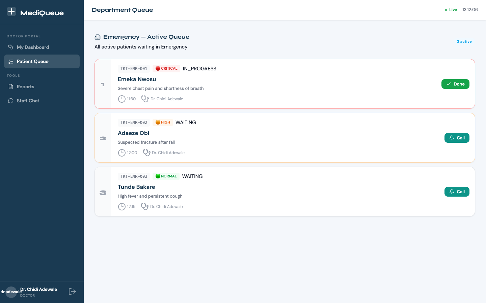

Shows every **active** patient across the entire department (not just assigned to the current doctor). Useful when covering for a colleague or triaging walk-ins.

**Columns visible:** position, priority bar + badge, ticket number, status, patient name, chief complaint, registration time, and the assigned doctor's name (if any).

Same action buttons as the dashboard (Call / Start / Done / No-Show). Also subscribes to the department's WebSocket topic so the list refreshes automatically.

---

## Admin Portal

### Dashboard — `GET /admin/dashboard`

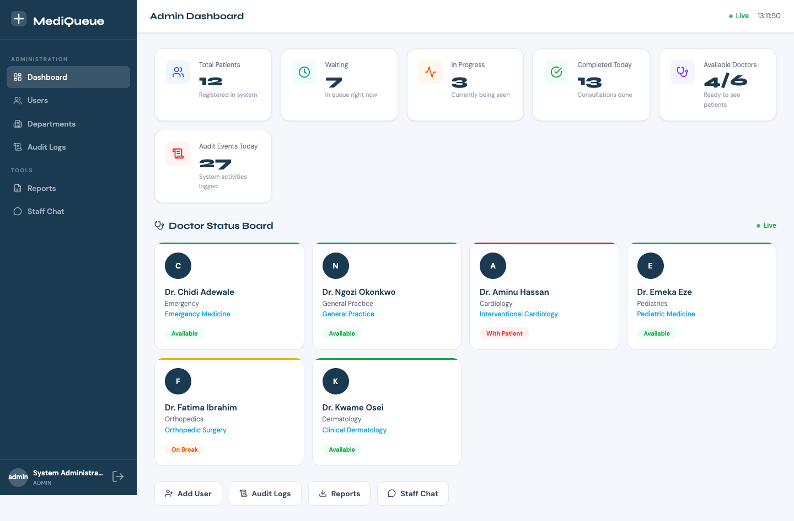

A high-level overview of the entire system.

**Stats grid (6 cards):**

| Stat | Colour | What it shows |
|---|---|---|
| Total Patients | Blue | All patients in the system |
| Waiting | Teal | Patients currently waiting |
| In Progress | Orange | Patients being seen |
| Completed Today | Green | Finished consultations today |
| Available Doctors | Purple | Count + ratio (e.g., 3/6) |
| Audit Events Today | Red | System activity events |

**Doctor Status Board:**
- One card per doctor showing name, department, specialisation, and a colour-coded status badge.
- Cards update live via WebSocket (`/topic/doctor-status`).

**Quick Action buttons:** Add User → `/admin/users` | Audit Logs → `/admin/audit-logs` | Reports → `/reports` | Staff Chat → `/chat`

---

### User Management — `GET /admin/users`

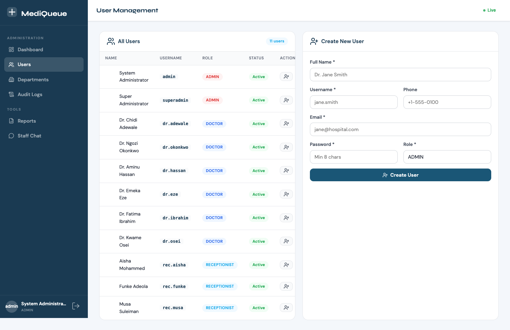

Split layout: user list on the left, create-user form on the right.

**Users table columns:** Name, Username, Role (colour-coded badge), Status (Active / Disabled), Actions.

**Row actions:**
- **Toggle** (`POST /admin/users/{id}/toggle`): Enables or disables the account.
- **Delete** (`DELETE /admin/users/{id}`): Permanently removes the user.

**Create User form (right panel):**
1. Fill in Full Name, Username, Email, Phone, Password, and Role.
2. Selecting **DOCTOR** reveals Department, Specialisation, and License Number fields.
3. Submit with `POST /admin/users/create`.

---

### Department Management — `GET /admin/departments`

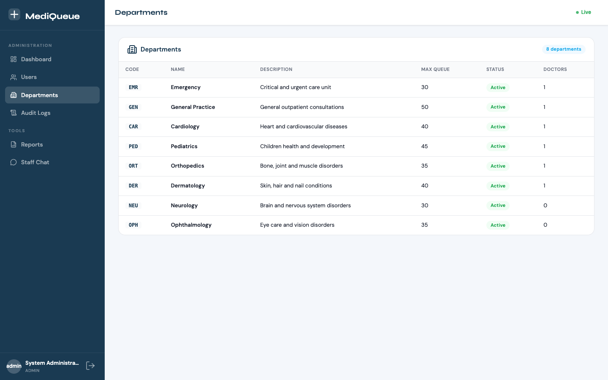

Read-only reference table listing all departments.

**Columns:** Code, Name, Description, Max Queue Capacity, Status (Active / Inactive), Doctor Count.

---

### Audit Logs — `GET /admin/audit-logs`

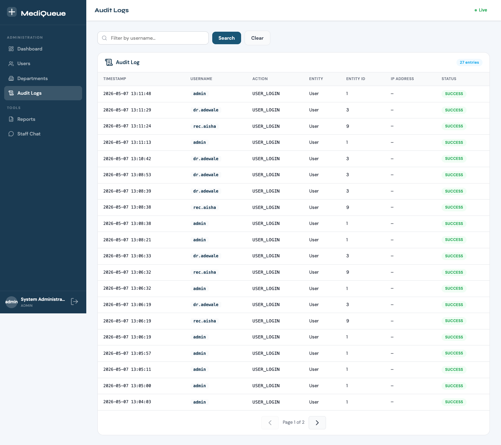

Full activity log for the entire system.

**Filter bar:** Search by username, then submit or clear.

**Table columns:** Timestamp, Username, Action, Entity Type, Entity ID, IP Address, Status (SUCCESS in green / FAILURE in red with red row highlight).

**Pagination:** Previous / Next buttons with current page and total page count.

---

## Reports Module

### Reports Page — `GET /reports`

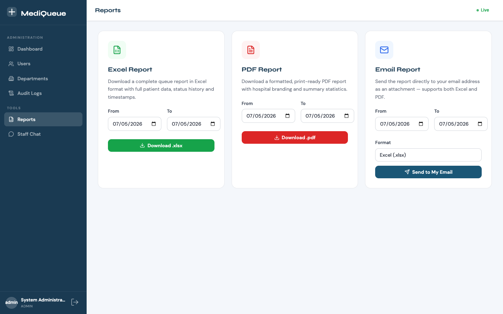

Accessible by **ADMIN** and **DOCTOR** roles. Three export options, each with a *From* and *To* date selector defaulting to today.

| Card | Action | Endpoint |
|---|---|---|
| **Excel Report** | Downloads a `.xlsx` file with full queue data, styled headers, alternating row colours, and a summary row. | `GET /reports/excel?from=YYYY-MM-DD&to=YYYY-MM-DD` |
| **PDF Report** | Downloads a landscape A4 `.pdf` with a title, summary stats box, and paginated data table. | `GET /reports/pdf?from=YYYY-MM-DD&to=YYYY-MM-DD` |
| **Email Report** | Sends the report (Excel or PDF, selectable) to the current user's registered email. A confirmation message appears on screen. | `POST /reports/email?format=excel|pdf&from=YYYY-MM-DD&to=YYYY-MM-DD` |

---

## Staff Chat

### Chat Room — `GET /chat`

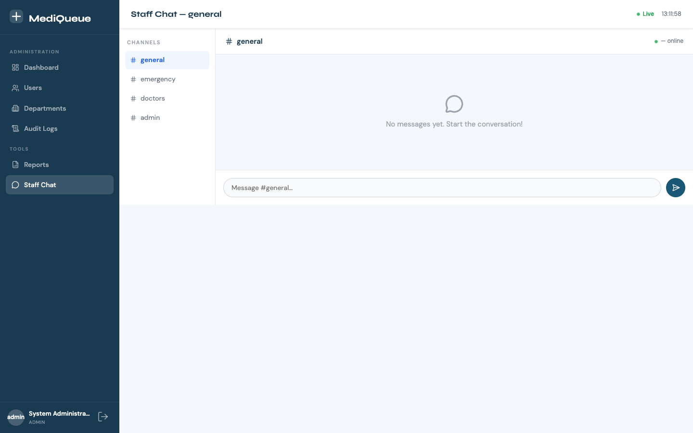

Real-time messaging for all authenticated staff.

**Sidebar (left):** Four pre-defined channels.

| Channel | Who can see it |
|---|---|
| `#general` | All staff |
| `#emergency` | All staff |
| `#doctors` | All staff |
| `#admin` | ADMIN role only |

Clicking a channel switches the main panel and highlights the active room.

**Main chat area:**
- **Header:** Channel name and live online user count.
- **Message feed:** Last 50 messages loaded on join (via `GET /api/chat/{roomId}/history?limit=50`). Each message shows the sender's avatar (initials), name, timestamp, and message text. Your own messages align to the right.
- **Typing indicator:** Displays `"[Name] is typing…"` with animated dots; auto-dismisses after 2 seconds of inactivity.
- **Input bar:** Type a message and press **Enter** to send (Shift+Enter for a newline). Messages are sent to `/app/chat/{roomId}` over WebSocket.

---

## Real-Time Features

All real-time updates use SockJS/STOMP over the `/ws` endpoint. The connection auto-reconnects after a 5-second delay if dropped.

### Queue Updates

| Topic | Who subscribes | What triggers it |
|---|---|---|
| `/topic/queue/global` | Receptionist dashboard | Any queue event system-wide |
| `/topic/queue/{departmentId}` | Doctor dashboard | Events in that department only |
| `/topic/doctor-status` | Admin dashboard | Any doctor changes their status |

When an event arrives:
- **PATIENT_ADDED** → toast notification appears.
- **STATUS_CHANGED** → waiting / in-progress counters refresh; affected queue cards flash briefly.

### Chat

| Action | WebSocket destination |
|---|---|
| Send message | `/app/chat/{roomId}` |
| Receive message | Subscribe to `/topic/chat/{roomId}` |
| Send typing signal | `/app/chat/{roomId}/typing` |
| Receive typing signal | Subscribe to `/topic/chat/{roomId}/typing` |

---

## Queue Status Lifecycle

```
                 ┌──────────┐
  Patient added  │ WAITING  │
  ─────────────► │          │
                 └────┬─────┘
                      │  Doctor clicks "Call"
                      ▼
                 ┌──────────┐
                 │  CALLED  │
                 └────┬─────┘
          ┌───────────┴───────────┐
          │                       │
          │ Doctor clicks "Start" │ Doctor clicks "No-Show"
          ▼                       ▼
   ┌─────────────┐         ┌──────────┐
   │ IN_PROGRESS │         │ NO_SHOW  │
   └──────┬──────┘         └──────────┘
          │ Doctor clicks "Done"
          ▼
    ┌───────────┐
    │ COMPLETED │
    └───────────┘

  (Any status) ──► CANCELLED   (manual cancellation by receptionist/admin)
```

**Priority order when calling next:** CRITICAL (1) → HIGH (2) → NORMAL (3) → LOW (4). Within the same priority, patients are ordered by registration time (FIFO).

---

## Test Credentials

All test accounts use the password `Password@123`.

| Username | Role | Notes |
|---|---|---|
| `admin` | ADMIN | Full system access |
| `dr.adewale` | DOCTOR | Assigned to a department |
| `rec.aisha` | RECEPTIONIST | Front-desk access |

Additional seed doctors and receptionists are created by the V2 migration across all eight departments (Emergency, General, Cardiology, Pediatrics, Orthopedics, Dermatology, Neurology, Ophthalmology).

The H2 in-memory console is available at `http://localhost:8080/h2-console` when running the dev profile.
